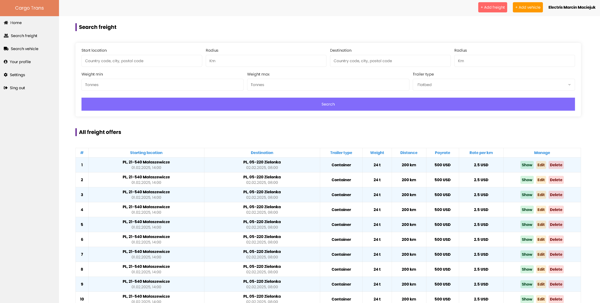

# Transport Freight Exchange (under development)
The Transport Freight Exchange is an application where users can add their offers of transport loads and vehicles. The freight offers will contain detailed data including the distance in kilometres between loading and unloading using the Google Maps Platform.
# Screenshots

    

